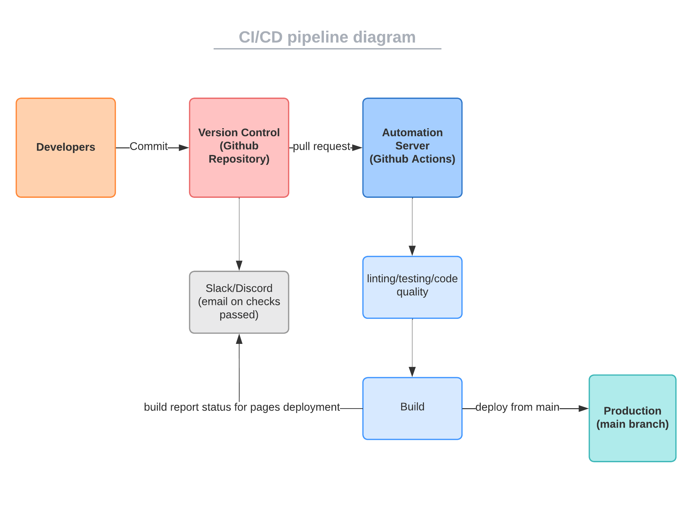

# CI/CD Pipeline Phase 1 Checkpoint 2 for 11/29
## Diagram
<!--Need to add diagram-->

[tool used for diagram](https://lucid.app/lucidchart/219da66c-ce45-4051-a3c9-53d3668fc611/edit?viewport_loc=-325%2C-155%2C3072%2C1545%2C0_0&invitationId=inv_4bfe75c0-b31d-4617-93cb-a366f037f60c)

## What works
- CSS linting
  - check for proper CSS formatting and styling
- HTML5 validation
  - checks for valid, working HTML
- Jest testing
- E2E testing
- add mandatory code review check for each pull request
  - ensure that each code deployed to main is reviewed by another member
- JsDocs automatically generated 
- main page being deployed onto github pages

## Potential features to add in the future
- automated status notifications to slack/discord for pull/merge requests
  - to keep team members notified on progress
- spell check (using prettier rn)
  - to avoid errors involving typos in syntax/variables

## Goal
- streamline the proccess of: source, build, test, deploy
  - want to be efficient while maintaining VCS integrity