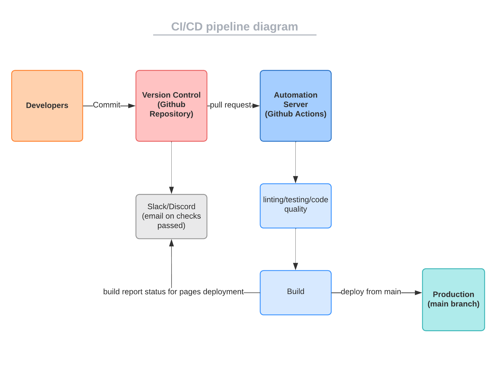

# CI/CD Pipeline Phase 2 for 11/29

## Diagram

<!--Need to add diagram-->

[Tool used for diagram](https://lucid.app/lucidchart/219da66c-ce45-4051-a3c9-53d3668fc611/edit?viewport_loc=-325%2C-155%2C3072%2C1545%2C0_0&invitationId=inv_4bfe75c0-b31d-4617-93cb-a366f037f60c)
[Phase 2 Video](./phase2.mp4)

## What works

- CSS linting
  - check for proper CSS formatting and styling
- HTML5 validation
  - checks for valid, working HTML
- Jest testing
- E2E testing
- Add mandatory code review check for each pull request
  - Ensure that each code deployed to main is reviewed by another member
- JSDocs automatically generated
- Main page is deployed onto GitHub Pages
- Add linting and formatting using ESLint and Prettier

## Potential features to add in the future

- Automate status notifications to slack/discord for pull/merge requests
  - Keeps team members notified on progress
- Have JSDocs be pushed onto main as well with a pr

## Goal

- Streamline the process of: source, build, test, deploy
  - Want to be efficient while maintaining VCS integrity
