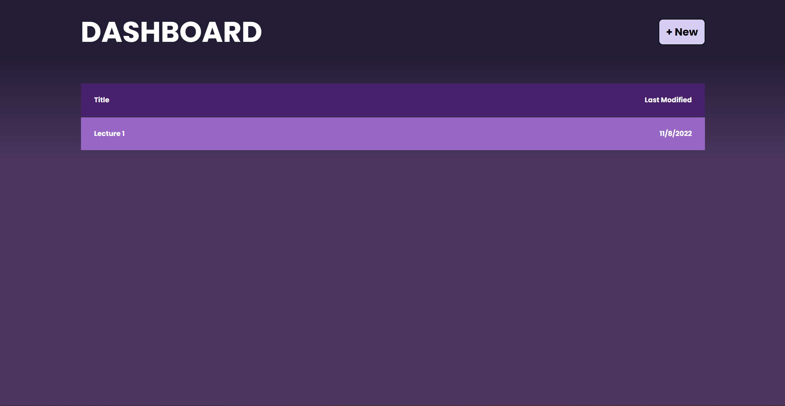

<!-- Note taker: Aaryan Tiwary-->
<!-- Month Date, 2022-->
# November 12, 2022 Meeting Minutes
​
<!-- XX:XX AM/PM -->
## Time
- Start: 7pm
- End: 7:20pm
​
<!-- TA or team, etc.-->
## Type of meeting: 
​Sprint Review Meeting 
<!-- [x] for present -->
## Attendance:
- [x] Yaya Jiang
- [] Kevin Lam
- [x] Aaryan Tiwary
- [x] Lauren Lee
- [x] Priya Senthilkumar
- [x] Duy Vu
- [x] Alex Zhang
- [x] Akanksha Pandey
- [x] Zelong Zhou
- [x] Guidong Luo
​
<!-- Topics for the meeting-->
# Agenda
- Process Review of Each Subteam
- Demo by each subteam (if possible)
- Suggestions (if any) 
​
<!-- homework basically zzzz-->
# Things to do for next meeting:
- Retrospective Meeting 10 min after this
​
<!-- what was discussed for each topic-->
# Main Ideas:
- Dashboard: Implemented main dashboard (local storage), made special component for list items, new click button allocates space and storage 
- Front End and backend: new button, showed us what the interface looks like, mostly just testing, showed us front end and backend, bare minimum accomplished
- Functionality: Demoed how to read in a note, update the current one, we can associate a node, new note generated new ID for this, id corressponds to a page, 3 items get filled out, 
- Some teams are still Reviewing syntax rn and working further.
- CICD: Jest - Unit testing, default script for dummy javascript file, explained what jest testing is, explained what linting is, basic tests for html and css (validation)files were demoed. 
# Image

