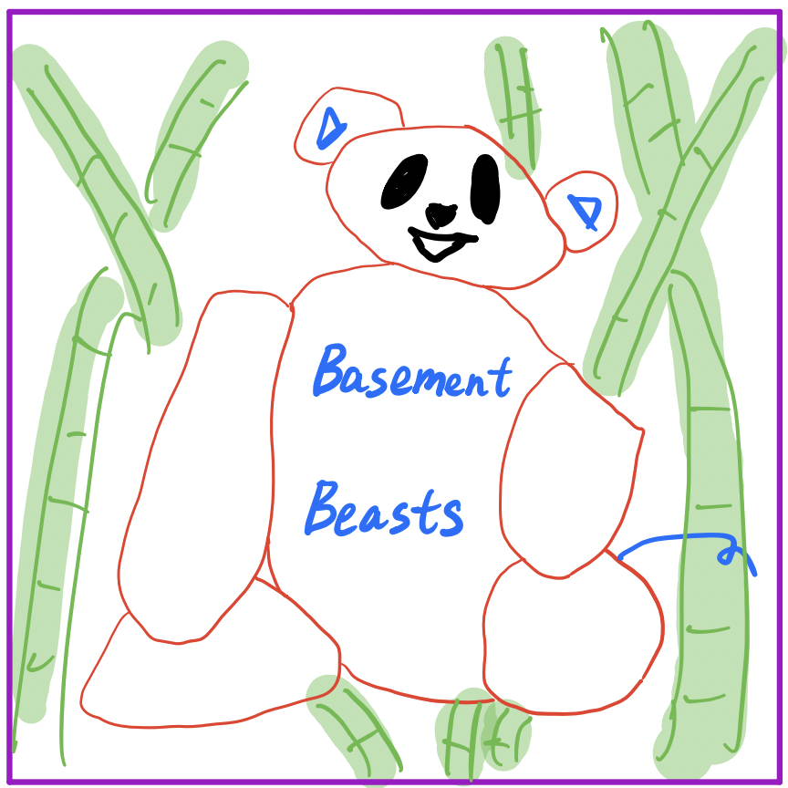
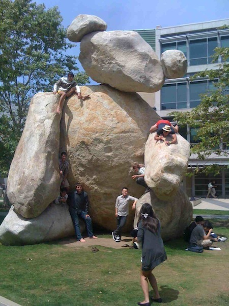

# Team Name
Basement Beasts

# Branding

# Team Values
- Trust
- Humility
- Respect
- Embrace Failure
- Be Supportive
- Open Communication
- Accountability

# Roster 
- Alex Zhang
  - I'm a second year Computer Engineering major from Seventh College.
  - [Github](https://github.com/alexzhang1618)
- Guidong (Grey) Luo
  - I am a second year Math-CS major.
  - [Github](https://github.com/greyluo)
- Priya Senthilkumar
  - I'm a second year transfer Computer Science major from San Jose, CA.
  - [Github](https://github.com/priyakumar0817)
- Jinya (Yaya) Jiang
  - I am a second year transfer student major in Computer Science from China.
  - [Github](https://github.com/yayajjiang)
- Aaryan Tiwary
  - I am a third year Computer Engineering major from India.
  - [Github](https://github.com/atiwaryandroid)
- Akanksha Pandey
  - I’m a third year CS major from San Ramon, CA.
  - [Github](https://github.com/akanksha-maker-ucsd)
- Duy (Tony) Vu
  - I’m a senior Math-CS major from San Jose, CA.
  - [Github](https://github.com/quocduyvu6262)
- Kevin Lam
  - I’m a fourth year CS major from Montclair, CA.
  - [Github](https://github.com/ckckcake)
- Lauren Lee
  - I’m a third year Math-CS major from Cupertino, CA.
  - [Github](https://github.com/laurenkiyomi)
- Zelong Zhou
  - I'm a fourth year CS major from Sixth College.
  - [Github](https://github.com/Arlong-Z)