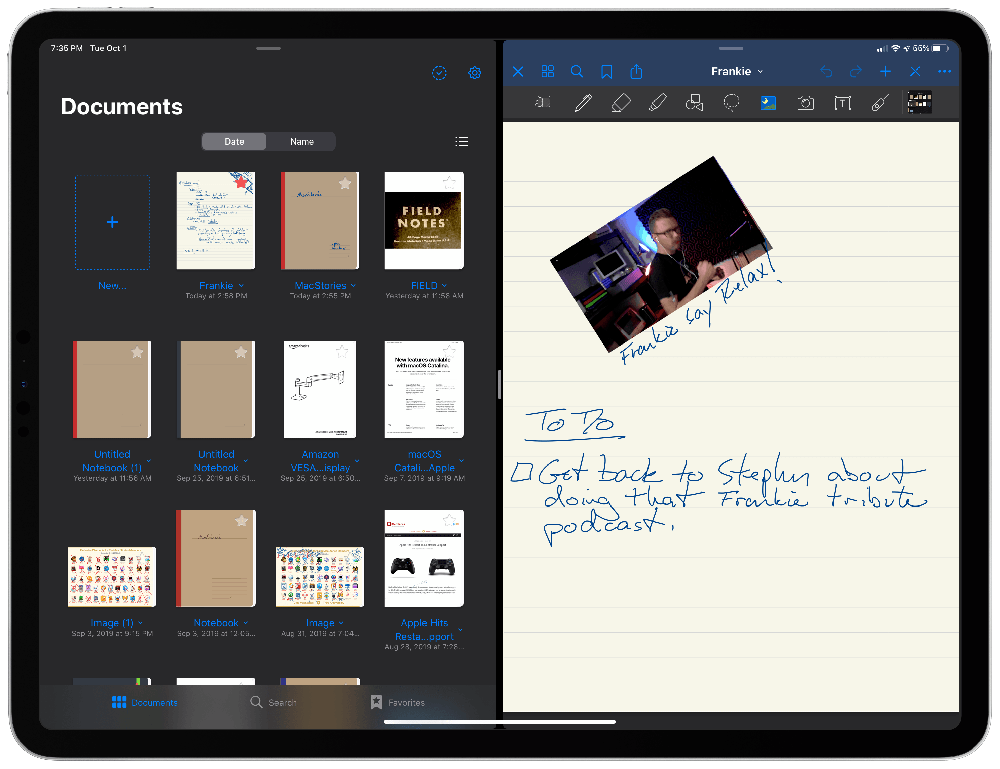
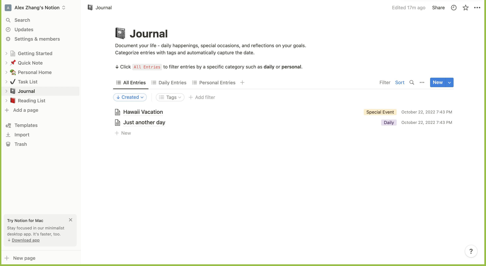

# GoodNotes
- 
- Dual view of files and current note
- Can put notes on the left side too

# Google Docs
- 
- Like how headings are clickable on the left
- Bad: Cluttered and unintuitive at the top
- Bad: All white
- Bad: Templates are bad

# Notion
- 
- We like the display view for notes
- Can filter and sort notes
- Search icon
- Left navigation bar makes it easy to switch between pages